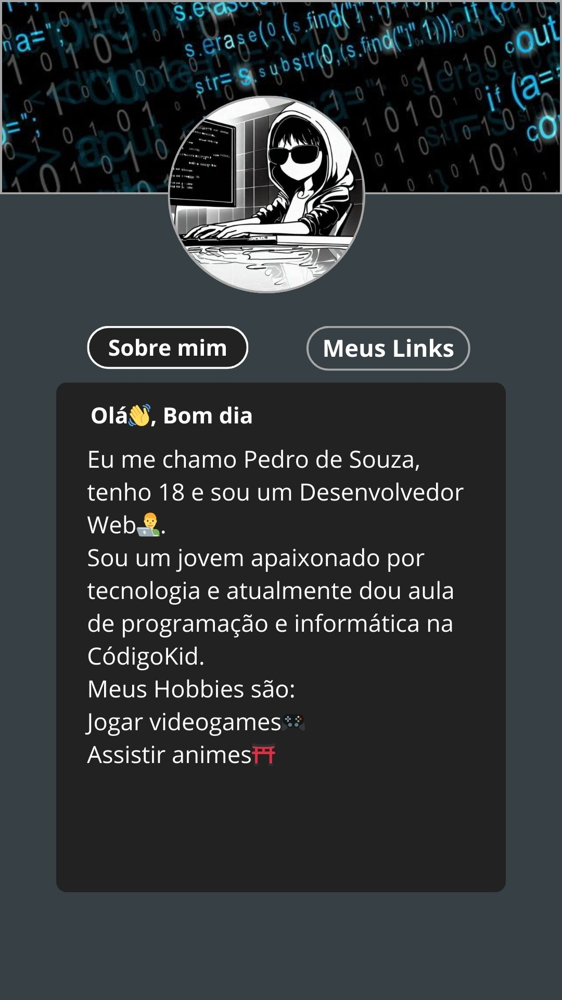
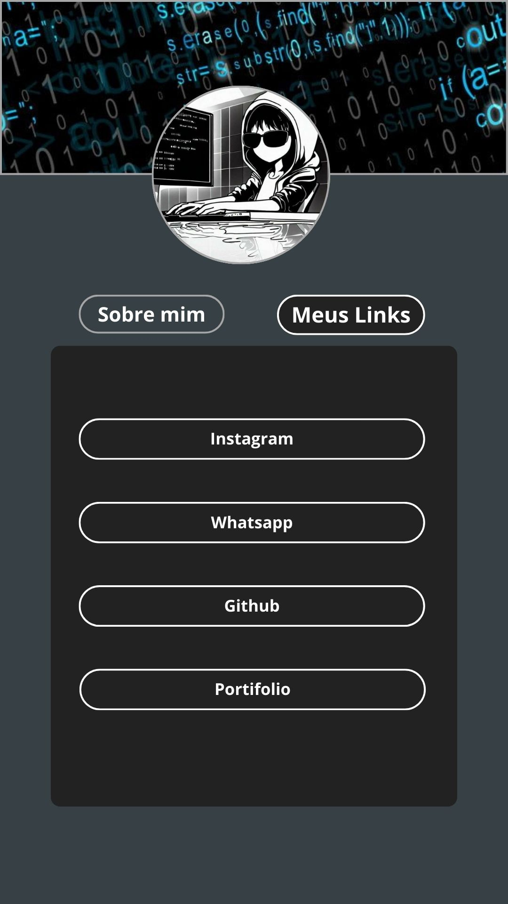

# Linktree para as redes sociais
Este projeto é um linktree para as minhas redes sociais, o objetivo é facilitar para que outras pessoas, atráves desta árvore de links, encontre melhor minhas redes sociais de contato e meu portifolio.

<ul style="list-style-type: none; display:flex; justify-content: center; align-items: center; flex-wrap:wrap; gap: 1rem">
<li><a href="#design" style="color: #000; text-decoration: none">Design</a></li>
<li><a href="#cores-do-projeto" style="color: #000; text-decoration: none">Cores</a></li>
<li><a href="#imagens-usadas-no-projeto" style="color: #000; text-decoration: none">Imagens</a></li>
<li><a href="#links-dispostos-na-linktree" style="color: #000; text-decoration: none">Links</a></li>
<li><a href="#texto-da-seção-sobre-mim" style="color: #000; text-decoration: none">Textos do projeto</a></li>

## Design
As imagens abaixo tratam do design preciso da linktree.

    
    

## Cores do projeto
Body: #374145
Color, button active border: #fff
img 1 border, img 2 border, button desactive border: #A6A6A6
Main, button active bacground: #222222

## Imagens usadas no projeto

    
    

## Links dispostos na linktree

[Instagram](https://www.instagram.com/pp_henrique1/)
[Whatsapp](https://wa.me/+5594993038120)
[Github](https://github.com/Pedro-OSouza/Pedro-OSouza)
[Portifolio](https://pedrodesouza.netlify.app/)

## Texto da seção "Sobre mim"
Olá👋, Bom dia
Eu me chamo Pedro de Souza, tenho 18 e sou um Desenvolvedor Web👨‍💻.
Sou um jovem apaixonado por tecnologia e atualmente dou aula de programação e informática na CódigoKid.
Meus Hobbies são: 
Jogar videogames🎮 
Assistir animes⛩️
 